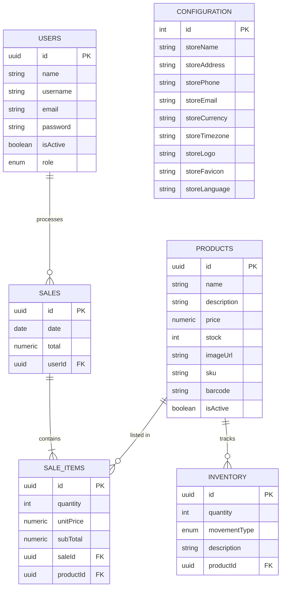

# 🧾 PΩS System API (NestJS + PostgreSQL)

A RESTful API for product management in a Point of Sale system. Built with **NestJS**, **PostgreSQL**, and documented with **Swagger**. Currently under development.

---

## 📋 Table of Contents

- [Project Status](#-project-status)
- [Database Schema](#-database-schema)
- [Technologies](#-technologies)
- [Features & Functions](#-features--functions)
- [Configuration](#-configuration)
- [Installation](#-installation)
- [Running the Application](#-running-the-application)
- [Deployment](#-deployment)
- [API Documentation](#-api-documentation)

---

## 🚧 Project Status

🔨 **In progress** — features implemented:

- [x] Products module
- [x] Sales module
- [x] Inventories module
- [x] Users module
- [x] Authentication with JWT
- [x] Route protection with AuthGuard
- [x] Automatic Admin Seeding

📝 **Upcoming tasks:**

- [ ] Role-based access control (`@Roles()`, `RolesGuard`) - _Partially implemented_
- [ ] `/me` endpoint for authenticated user profile

---

## 🗄️ Database Schema

The following Entity-Relationship (ER) diagram illustrates the database structure and relationships between entities.



---

## 🚀 Technologies

- **Core Framework**: NestJS
- **Database**: PostgreSQL
- **ORM**: TypeORM
- **Containerization**: Docker
- **Documentation**: Swagger
- **Validation**: class-validator
- **Authentication**: Passport / JWT

---

## 🧩 Features & Functions

The API is organized into several modules, each handling specific business logic:

### 🔐 Authentication (`/auth`)

- **Login**: Authenticates users and issues JWT tokens.
- **Register**: Registers new users (if allowed).
- **Guards**: Protects routes using JWT strategies.

### 👤 Users (`/users`)

- **Management**: Create, read, update, and delete system users.
- **Roles**: Supports different user roles (e.g., ADMIN, SELLER).
- **Seeding**: Automatically creates a default Admin user if none exists.

### 📦 Products (`/products`)

- **Catalog**: Manage product details including pricing, SKU, barcodes, and images.
- **Stock Tracking**: Maintains current stock levels (updated via Inventory).

### 📊 Inventory (`/inventory`)

- **Movements**: Tracks stock changes (Input/Output).
- **History**: Records the history of product movements.

### 💰 Sales (`/sales`)

- **Processing**: Records sales transactions.
- **Items**: Handles individual items within a sale, calculating subtotals automatically.
- **Reporting**: (Future) Generate sales reports.

### ⚙️ Configuration (`/configuration`)

- **Store Settings**: Manage global store settings like name, address, currency, and logo.

---

## ⚙️ Configuration

The application requires environment variables to be set. Create a `.env` file in the root directory.

**Development (`.env`):**

```env
DB_HOST=postgres
DB_PORT=5432
POSTGRES_USER=postgres
POSTGRES_PASSWORD=secret
POSTGRES_DB=posdb
PORT=3000
JWT_SECRET=your_jwt_secret
NODE_ENV=development
```

**Production (`.env`):**

```env
DB_HOST=postgres
DB_PORT=5432
POSTGRES_USER=postgres
POSTGRES_PASSWORD=secure_password
POSTGRES_DB=posdb_prod
PORT=3000
JWT_SECRET=complex_secure_secret
NODE_ENV=production
```

---

## 🛠️ Installation

1.  **Clone the repository:**

    ```bash
    git clone <repository-url>
    cd pos_system_api
    ```

2.  **Install dependencies:**
    ```bash
    pnpm install
    ```

---

## ▶️ Running the Application

### 🐳 Using Docker (Recommended)

Docker simplifies setup by spinning up both the API and the PostgreSQL database.

**Development:**

```bash
# Starts API and DB with hot-reload
docker-compose up --build
```

**Production:**

```bash
# Starts optimized API and DB for production in background
docker-compose -f docker-compose.prod.yml up --build -d
```

### 💻 Local (Without Docker)

If you prefer running the Node.js app locally, ensure you have a PostgreSQL instance running and configured in your `.env`.

```bash
# Run in development mode
pnpm run start:dev

# Build and run in production mode
pnpm run build
pnpm run start:prod
```

### 🔐 Automatic Admin Seeding

When the application starts, if the database is empty of users, a default admin is created:

- **Email:** `admin@admin.com`
- **Password:** `admin123`
- **Role:** `ADMIN`

---

## 🚢 Deployment

The application is designed to be easily deployed using **Docker**.

1.  **Containerization**: The app is packaged into a Docker container, ensuring consistency across environments.
2.  **Orchestration**: `docker-compose` manages the multi-container application (NestJS API + PostgreSQL).
3.  **Production Build**: The production Dockerfile uses multi-stage builds to create a lightweight image, installing only production dependencies and compiling the TypeScript code.

To deploy:

1.  Set up your server (e.g., VPS, AWS EC2).
2.  Install Docker and Docker Compose.
3.  Clone the repo and set up your production `.env` file.
4.  Run `docker-compose -f docker-compose.prod.yml up -d`.

---

## 🚢 Despliegue (Render: API + Postgres en la misma instancia)

Este repo incluye `render.yaml` y un `Dockerfile` que inicializa Postgres dentro del contenedor y monta `/var/lib/postgresql/data` para persistencia. No guardes secretos en el repo: usa los Secret variables de Render.

Pasos rápidos en Render (Dashboard o CLI):

1) Crea un servicio Web y conecta tu repo (o usa `render.yaml` para configuración automática).
2) Crea un Persistent Disk (ej: 10 GB) y monta en `/var/lib/postgresql/data` o deja que `render.yaml` lo gestione.
3) Añade Secrets en el servicio (no en el repo): `POSTGRES_PASSWORD`, `JWT_SECRET`, `JWT_REFRESH_SECRET`.
4) Despliega desde la rama `main` (Render usará el `Dockerfile` del repo).

Ejemplo `render.yaml` ya incluido en el repo para desplegar automáticamente con disco y variables enlazadas a secrets.

Si prefieres usar una base de datos administrada (recomendado), crea un Managed Postgres en Render y configura la variable `DATABASE_URL` o `DB_HOST/POSTGRES_*` en el servicio.

## 📚 API Documentation

Interactive API documentation is generated with Swagger.

**Access it locally at:**

```
http://localhost:3000/api
```

---

## 🧠 Author

**Carlos Alfredo Pérez Hernández** — Computer Systems Engineer
